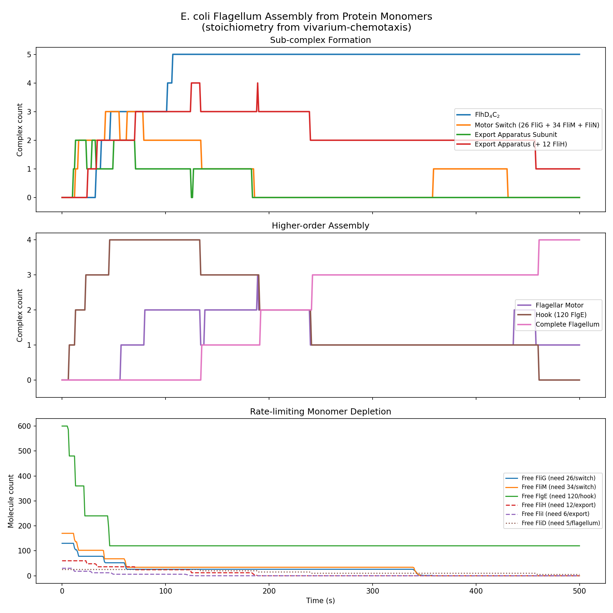
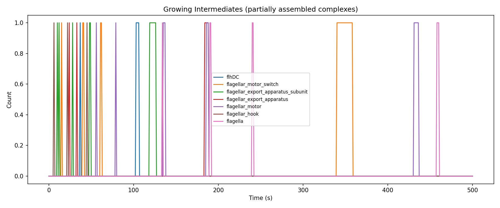
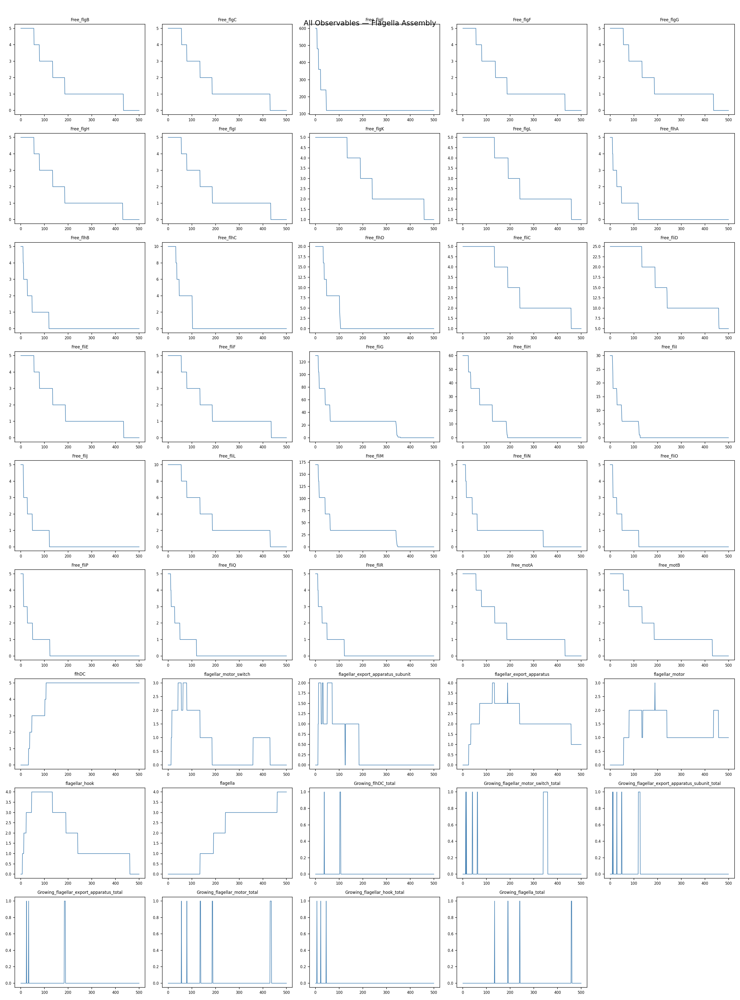

# vivarium-nfsim

A [process-bigraph](https://github.com/vivarium-collective/process-bigraph) wrapper for [BioNetGen](https://bionetgen.org/)/[NFSim](https://github.com/RuleWorld/nfsim).

This package provides a `Process` that runs rule-based models written in BNGL using the NFSim network-free simulator, enabling their composition with other processes in the process-bigraph framework.

## Installation

```bash
pip install vivarium-nfsim
```

## Usage

```python
from process_bigraph import Composite, process_registry
from vivarium_nfsim.process import NFSimProcess

process_registry.register('nfsim', NFSimProcess)

instance = {
    'nfsim': {
        '_type': 'process',
        'address': 'local:nfsim',
        'config': {
            'model_file': 'path/to/model.bngl',
            'n_steps': 50,
        },
        'wires': {
            'observables': ['observables_store'],
            'parameters': ['parameters_store'],
            'time': ['time_store'],
        }
    },
}

workflow = Composite({'state': instance})
workflow.run(100)
results = workflow.gather_results()
```

## E. coli Flagella Complexation Model

The main demonstration model simulates the **hierarchical assembly of the E. coli flagellum
from protein monomers**, based on the complexation stoichiometry defined in
[vivarium-chemotaxis](https://github.com/vivarium-collective/vivarium-chemotaxis/blob/master/chemotaxis/data/chromosomes/flagella_chromosome.py).

### Biological background

The bacterial flagellum is a complex molecular machine assembled from ~30 different
proteins in a strict hierarchical order. The assembly pathway proceeds through seven
complexation reactions, each requiring specific subunits at defined stoichiometries:

| Reaction | Product | Subunits |
|----------|---------|----------|
| 1 | **FlhDC** (master regulator) | 4 FlhD + 2 FlhC |
| 2 | **Motor switch** (C-ring) | 26 FliG + 34 FliM + 1 FliN |
| 3 | **Export apparatus subunit** | FlhA + FlhB + FliO + FliP + FliQ + FliR + FliJ + 6 FliI |
| 4 | **Export apparatus** | subunit + 12 FliH |
| 5 | **Flagellar motor** (basal body) | switch + 2 FliL + FlgH + MotA + MotB + FlgB + FlgC + FlgF + FlgG + FlgI + FliF + FliE |
| 6 | **Hook** | 120 FlgE |
| 7 | **Complete flagellum** | export apparatus + motor + FliC + FlgL + FlgK + 5 FliD + hook |

### Modeling approach in BioNetGen/NFSim

BioNetGen only supports unimolecular and bimolecular reactions. To model the multi-subunit
assembly reactions above (some requiring up to 120 copies of a single protein), we use a
**scaffold-with-counters** strategy:

1. **Scaffold molecule types** — For each complexation reaction, a `Growing_*` molecule type
   is defined with internal state counters that track how many of each subunit have been
   incorporated. For example, the growing motor switch has three counters:

   ```
   Growing_flagellar_motor_switch(
       fliG~0~1~2~...~26,
       fliM~0~1~2~...~34,
       fliN~0~1
   )
   ```

2. **Nucleation** — A bimolecular reaction between two monomers creates a new scaffold.
   The **scarcest monomer** is always chosen for nucleation to prevent over-nucleation
   (e.g., the motor switch nucleates with FliN + FliG, not FliG + FliG, since FliN is
   limiting). Nucleation rates are auto-computed from initial monomer counts to yield
   approximately *n_flagella* nucleation events over the simulation timescale.

3. **Sequential growth** — Each remaining monomer binds one at a time via bimolecular rules:

   ```
   Growing_flagellar_motor_switch(fliG~i) + fliG() ->
       Growing_flagellar_motor_switch(fliG~{i+1})    k_bind
   ```

4. **Completion** — When all counters reach their target values, a unimolecular rule
   converts the scaffold into the finished complex:

   ```
   Growing_flagellar_motor_switch(fliG~26, fliM~34, fliN~1) ->
       flagellar_motor_switch()    k_completion
   ```

This approach generates **237 reaction rules** from the 7 biological assembly reactions.
NFSim handles this efficiently because it tracks individual molecules and never enumerates
the full species space.

The BNGL model is generated programmatically from the stoichiometry data by
[`generate_flagella_bngl.py`](vivarium_nfsim/models/generate_flagella_bngl.py).

### Running the experiment

```bash
# Generate the BNGL model from stoichiometry data
python -m vivarium_nfsim.models.generate_flagella_bngl

# Run the NFSim simulation and generate plots
python -m vivarium_nfsim.experiments.flagella_complexation
```

### Results

The simulation starts with enough monomers for 5 complete flagella and runs for 500
seconds of simulated time.

**Assembly dynamics** — Sub-complexes form first (FlhDC in seconds, motor switches and
export apparatus over tens of seconds), followed by higher-order assembly (motors, hooks,
complete flagella). The stochastic nature of NFSim produces realistic single-molecule
assembly kinetics.



**Growing intermediates** — Scaffold molecules appear transiently as monomers bind
sequentially, then convert to completed complexes. Each spike represents a single scaffold
being assembled and completed.



**All observables** — Individual time courses for all 44 tracked quantities: free monomers,
completed complexes, and growing intermediates.



## Project Structure

```
vivarium-nfsim/
├── setup.py
├── README.md
├── doc/                                     # result figures
├── vivarium_nfsim/
│   ├── __init__.py
│   ├── process.py                           # NFSimProcess (process-bigraph wrapper)
│   ├── models/
│   │   ├── generate_flagella_bngl.py        # generates BNGL from stoichiometry data
│   │   ├── flagella_complexation.bngl       # generated model (237 rules, 44 mol types)
│   │   └── toggle_switch.bngl              # simple test model
│   └── experiments/
│       ├── __init__.py
│       └── flagella_complexation.py         # run NFSim simulation and plot results
└── output/                                  # raw simulation output (not committed)
```
